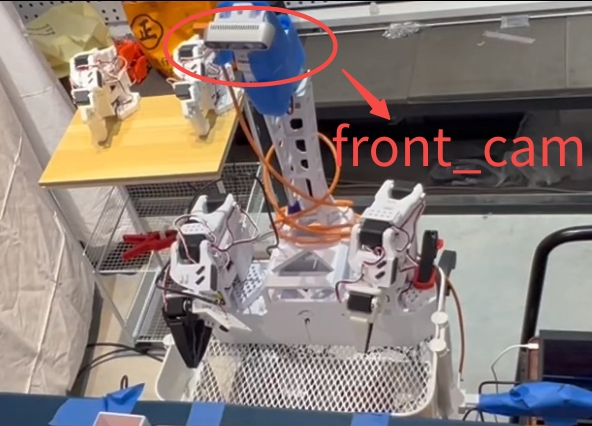
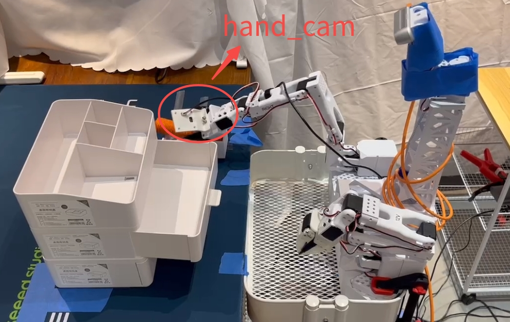
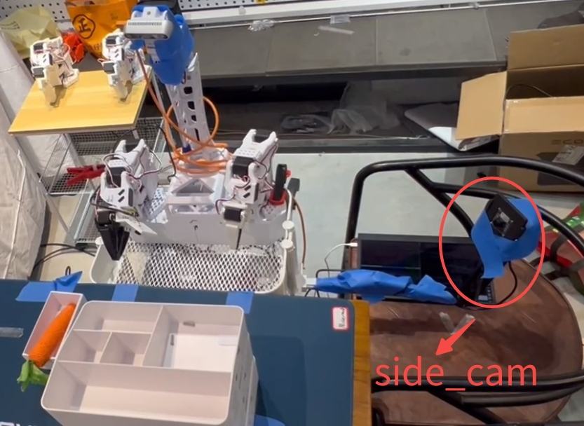
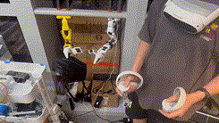
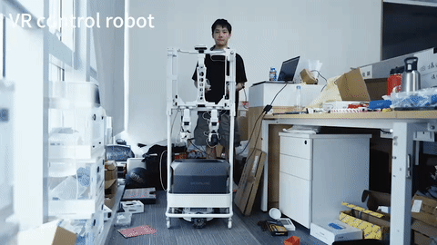

# SmolVLA_FOR_XLeRobot

<div align="center">

[](https://www.bilibili.com/video/BV1qJWXzXEV7/)
[](https://www.bilibili.com/video/BV1qJWXzXEV7/)

**🏆 3rd Place Winner at 2025 Seeed × NVIDIA × LeRobot Hackathon**

<a href="https://www.bilibili.com/video/BV1qJWXzXEV7/" target="_blank">
  
</a>

*Click the GIF to watch the full demonstration on Bilibili*

</div>

---

This repository is forked from [huggingface/lerobot](https://github.com/huggingface/lerobot) and based on commit [`f55c6e8`](https://github.com/huggingface/lerobot/commit/f55c6e8) (Dataset v3).

## System Demonstrations

<div align="center">
  <table>
    <tr>
      <td align="center" width="33%">
        
        <p><em>Bimanual manipulation demo</em></p>
      </td>
      <td align="center" width="33%">
        
        <p><em>Side view demonstration</em></p>
      </td>
      <td align="center" width="33%">
        
        <p><em>Task execution demo</em></p>
      </td>
    </tr>
  </table>
</div>

---

## New Features

### SO-101 Bimanual Robot Support

Added support for bimanual SO-101 robot data collection, including:

- **BiSO101Follower**: Dual-arm follower robot implementation
  - Manages left and right SO-101 follower arms independently
  - Unified interface with automatic prefix handling (`left_*`, `right_*`)
  - Synchronized observation and action control

- **BiSO101Leader**: Dual-arm leader teleoperator
  - Teleoperation control for bimanual manipulation
  - Feedback support for both arms

- Seamless integration with existing LeRobot recording and replay pipeline

**Hardware Configuration:**

- **Cameras (3 total)**:
  - `front_cam`: Front-facing camera for global scene view
  - `hand_cam`: Wrist-mounted camera for close-up manipulation view
  - `side_cam`: Side-view camera for scene observation

<div align="center">
  <table>
    <tr>
      <td align="center" width="33%">
        
        <p><strong>front_cam</strong></p>
      </td>
      <td align="center" width="33%">
        
        <p><strong>hand_cam</strong></p>
      </td>
      <td align="center" width="33%">
        
        <p><strong>side_cam</strong></p>
      </td>
    </tr>
  </table>
</div>

**Implementation Details:**
- Reuses existing `SO101Follower` and `SO101Leader` implementations through composition
- Added factory methods in `robots/utils.py` and `teleoperators/utils.py`
- Configuration support for independent arm settings (ports, torque, calibration)

**Action Dimension Handling (SmolVLA Built-in Feature):**

> **Note:** The following is a built-in capability of SmolVLA, not a modification made in this fork.

The bimanual SO-101 has 12 action dimensions (6 joints × 2 arms), which SmolVLA automatically handles without manual configuration:

```python
# SmolVLA automatically detects action dimensions from dataset
# Training: 12-dim → pad to 32-dim (max_action_dim)
actions = pad_vector(batch[ACTION], self.config.max_action_dim)

# Inference: 32-dim → trim back to 12-dim
original_action_dim = self.config.action_feature.shape[0]  # auto-detected: 12
actions = actions[:, :, :original_action_dim]
```

Unlike other VLA models (e.g., xVLA) that require manual `action_mode` configuration, SmolVLA's dynamic padding system supports any action dimension ≤ 32 without code changes.

## Dataset Format

This fork uses the **LeRobot Dataset v3** format.

---

## Installation

### Prerequisites

- **Platform**: x86/x64 (Intel/AMD)
- **OS**: Ubuntu 20.04 or later
- **Python**: 3.10
- **Hardware**: SO-101 bimanual robot arms

### 1. Install Miniconda

```bash
# Download Miniconda installer
wget https://repo.anaconda.com/miniconda/Miniconda3-latest-Linux-x86_64.sh

# Run the installer
bash Miniconda3-latest-Linux-x86_64.sh

# Restart your terminal after installation, then verify
conda --version
```

### 2. Create and Activate Conda Environment

```bash
# Create a new conda environment named 'lerobot' with Python 3.10
conda create -n lerobot python=3.10

# Activate the environment
conda activate lerobot
```

**Note:** You'll need to activate this environment every time you work with LeRobot:
```bash
conda activate lerobot
```

### 3. Install System Dependencies

Install ffmpeg for video encoding/decoding:

```bash
# Using conda (recommended)
conda install -c conda-forge ffmpeg

# Or using apt (alternative)
# sudo apt-get update && sudo apt-get install ffmpeg
```

### 4. Clone the Repository

```bash
git clone https://github.com/kahowang/lerobot.git
cd lerobot
```

### 5. Install LeRobot with Dependencies

Install LeRobot with Feetech motor support:

```bash
# Install with feetech motor support (required for SO-101 robots)
pip install -e ".[feetech]"
```

### 6. Install SmolVLA Dependencies

Install SmolVLA for training and inference:

```bash
# Install SmolVLA dependencies
pip install -e ".[smolvla]"
```

This will install:
- `transformers` for the vision-language-action model
- `num2words` for natural language processing
- `accelerate` for distributed training
- `safetensors` for model serialization

---

## Usage

> **Reference Documentation:** For detailed setup instructions and troubleshooting, please refer to the [Seeed Studio LeRobot Wiki](https://wiki.seeedstudio.com/cn/lerobot_so100m_new/).

### 1. Data Collection with Three Cameras

Record demonstrations using the bimanual SO-101 robot with three camera views (`front_cam`, `hand_cam`, `side_cam`):

```bash
lerobot-record \
    --robot.type=bi_so101_follower \
    --robot.left_arm_port=/dev/ttyACM0 \
    --robot.right_arm_port=/dev/ttyACM1 \
    --robot.id=bimanual_follower \
    --robot.cameras='{
      "front_cam": {"type": "opencv", "index_or_path": 0, "width": 640, "height": 480, "fps": 30},
      "hand_cam": {"type": "opencv", "index_or_path": 1, "width": 640, "height": 480, "fps": 30},
      "side_cam": {"type": "opencv", "index_or_path": 2, "width": 640, "height": 480, "fps": 30}
    }' \
    --teleop.type=bi_so101_leader \
    --teleop.left_arm_port=/dev/ttyACM2 \
    --teleop.right_arm_port=/dev/ttyACM3 \
    --teleop.id=bimanual_leader \
    --dataset.repo_id=${HF_USER}/your_dataset_name \
    --dataset.single_task="Your task description here" \
    --dataset.num_episodes=50
```

**Notes:**
- Replace port values (`/dev/ttyACM0`, `/dev/ttyACM1`, etc.) with your actual device ports
- Replace `index_or_path` values (0, 1, 2) with your actual camera indices or paths
- Use `lerobot-find-port` to discover connected device ports
- Adjust camera parameters (width, height, fps) based on your hardware
- We recommend recording at least 50 episodes for optimal SmolVLA performance
- Use `--dataset.single_task` to describe your task in natural language

### 2. Train SmolVLA with Three Cameras

Fine-tune the SmolVLA model on your collected dataset:

```bash
lerobot-train \
    --policy.path=lerobot/smolvla_base \
    --dataset.repo_id=${HF_USER}/your_dataset_name \
    --batch_size=64 \
    --steps=20000 \
    --output_dir=outputs/train/smolvla_three_cameras \
    --job_name=smolvla_training_three_cameras \
    --policy.device=cuda \
    --wandb.enable=true
```

**Training Notes:**
- Training for 20k steps takes ~4 hours on a single A100 GPU
- Adjust `--batch_size` based on your GPU memory
- Use `--wandb.enable=true` to track training progress with Weights & Biases
- The model will automatically use all three camera views from your dataset
- Fine-tune `--steps` based on validation performance

### 3. Inference with SmolVLA

Run inference using your trained SmolVLA model with three cameras:

```bash
lerobot-record \
    --robot.type=bi_so101_follower \
    --robot.left_arm_port=/dev/ttyACM0 \
    --robot.right_arm_port=/dev/ttyACM1 \
    --robot.id=bimanual_follower \
    --robot.cameras='{
      "front_cam": {"type": "opencv", "index_or_path": 0, "width": 640, "height": 480, "fps": 30},
      "hand_cam": {"type": "opencv", "index_or_path": 1, "width": 640, "height": 480, "fps": 30},
      "side_cam": {"type": "opencv", "index_or_path": 2, "width": 640, "height": 480, "fps": 30}
    }' \
    --dataset.single_task="Your task description here" \
    --dataset.repo_id=${HF_USER}/eval_your_dataset_name \
    --dataset.episode_time_s=50 \
    --dataset.num_episodes=10 \
    --policy.path=${HF_USER}/smolvla_three_cameras
```

**Inference Notes:**
- Replace port values (`/dev/ttyACM0`, `/dev/ttyACM1`) with your actual follower arm ports
- Use the same camera configuration as during data collection
- Use the same task description as in your training dataset
- The policy will control the robot autonomously based on camera observations
- The evaluation results will be saved to `${HF_USER}/eval_your_dataset_name`
- Adjust `--dataset.num_episodes` for your evaluation needs

### 4. Replaying Collected Data

To replay and visualize collected episodes:

```bash
lerobot-replay \
    --robot.type=bi_so101_follower \
    --robot.left_arm_port=/dev/ttyACM0 \
    --robot.right_arm_port=/dev/ttyACM1 \
    --robot.id=bimanual_follower \
    --dataset.repo_id=${HF_USER}/your_dataset_name \
    --dataset.episode=0
```

**Replay Notes:**
- Replace port values with your actual follower arm ports
- The robot will replay the recorded actions from the specified episode
- Use `--dataset.episode` to select which episode to replay (0-indexed)

---

## VR Teleoperation System

For VR-based robot control, we also developed a ROS2 package that enables intuitive teleoperation of the SO-ARM101 robotic arms through VR controllers.

### VR Controller Demonstrations

<div align="center">
  <table>
    <tr>
      <td align="center" width="33%">
        
        <p><em>VR Teleoperation</em></p>
      </td>
      <td align="center" width="33%">
        
        <p><em>Dual Arm Control</em></p>
      </td>
      <td align="center" width="33%">
        
        <p><em>Chassis Control</em></p>
      </td>
    </tr>
  </table>
</div>

<div align="center">
  
  <p><em>VR Control Robot in Action</em></p>
</div>

**Features:**
- Real-time VR controller to robot end-effector mapping using inverse kinematics
- Support for single arm (left/right) or simultaneous dual arm operation
- Integrated mobile base control through VR joystick inputs
- VR trigger-based gripper control with dynamic calibration

For detailed setup and usage instructions, visit the VR controller repository:

**VR Controller Repository:** [lerobot_vr_controller](https://github.com/kahowang/lerobot_vr_controller)

---

## Original Repository

For full documentation, tutorials, and more information, please visit:
- Original Repository: [huggingface/lerobot](https://github.com/huggingface/lerobot)
- Documentation: [https://huggingface.co/docs/lerobot](https://huggingface.co/docs/lerobot)
- Community: [https://huggingface.co/lerobot](https://huggingface.co/lerobot)

## Citation

If you use this work, please cite:

### This Project

**Contributors:** [kahowang (王家浩)](https://github.com/kahowang) • [bubblepan (潘春波)](https://github.com/IIMFINE) • [Makermods](https://www.makermods.ai/)

```bibtex
@misc{wang2025smolvla_xlerobot,
    author = {Wang, Jiahao and Pan, Chunbo and Makermods},
    title = {SmolVLA for XLeRobot: Bimanual SO-101 Robot Control with Vision-Language-Action Model},
    howpublished = "\url{https://github.com/kahowang/lerobot}",
    year = {2025},
    note = {3rd Place Winner at 2025 Seeed × NVIDIA × LeRobot Hackathon}
}
```

### LeRobot
```bibtex
@misc{cadene2024lerobot,
    author = {Cadene, Remi and Alibert, Simon and Soare, Alexander and Gallouedec, Quentin and Zouitine, Adil and Palma, Steven and Kooijmans, Pepijn and Aractingi, Michel and Shukor, Mustafa and Aubakirova, Dana and Russi, Martino and Capuano, Francesco and Pascal, Caroline and Choghari, Jade and Moss, Jess and Wolf, Thomas},
    title = {LeRobot: State-of-the-art Machine Learning for Real-World Robotics in Pytorch},
    howpublished = "\url{https://github.com/huggingface/lerobot}",
    year = {2024}
}
```
